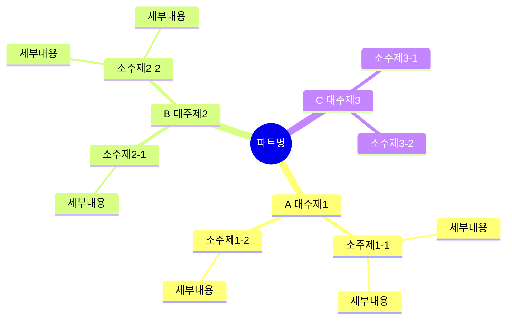

---

mindmap-plugin: markdown

---

# 파트번호 파트명 마인드맵

← [[원본노트파일명|원본 정리노트]]

---

---

## ★ 암기 포인트

| 키워드 | 내용 |
|--------|------|
| **키워드1** | 내용 |
| **키워드2** | 내용 |
| **키워드3** | 내용 |

---

## ★ 비교표

| 구분 | 항목A | 항목B |
|------|-------|-------|
| 비교1 | 값 | 값 |
| 비교2 | 값 | 값 |

---

> **작성 규칙**
> - 들여쓰기 2칸 = 한 단계 하위
> - 노드 안에 `( ) [ ] { }` 특수문자 쓰지 않기
> - `→` `←` 화살표 쓰지 않기 (파서 오류 원인)
> - 대신 `이후` `이면` `결과` 같은 한글로 대체
