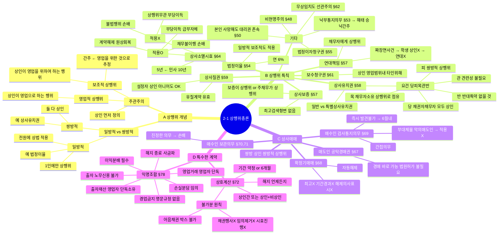

# 2-1 상행위총론 마인드맵

← [[2-1_상행위총론_정리노트|원본 정리노트]]

---

---

## ★ 암기 포인트

| 키워드 | 내용 |
|--------|------|
| **간주 vs 추정** | 보조상행위=간주 / 상인의 행위=추정 |
| **5년** | 상사소멸시효 |
| **6%** | 상사법정이율 |
| **당피목관반** | 상사유치권 요건 |
| **확정기매매** | 자동해제 (최고·기간·의사표시 모두 불필요) |
| **간접의무** | 검사·통지의무 위반 → 강제이행/손배X, 해제·감액·손배청구만 불가 |
| **6월 예고** | 익명조합 기간미정 해지 |
| **2월 예고** | 대리상 해지 |
| **예고 없이** | 상호계산 해지 |
