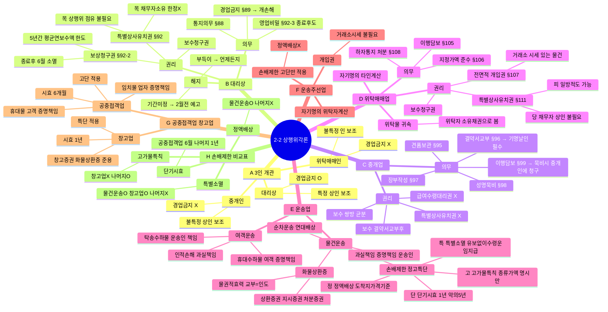

# 2-2 상행위각론 마인드맵

← [[2-2_상행위각론_정리노트|원본 정리노트]]

---

---

## ★ 암기 포인트

| | 대리상 | 중개인 | 위탁매매인 | 운송주선인 |
|--|:--:|:--:|:--:|:--:|
| 통지의무 | O | **X** | O | O |
| 특별유치권 | O | **X** | O | O |
| 경업금지 | O | **X** | **X** | **X** |

| 손배제한 | 물건운송 | 운송주선 | 공중접객 | 창고업 |
|--|:--:|:--:|:--:|:--:|
| 정액배상 | O | X | X | X |
| 고가물 | O | O | O | **X** |
| 특별소멸 | O | X | X | O |
| 단기시효 | O(1년) | O(1년) | O(**6월**) | O(1년) |
