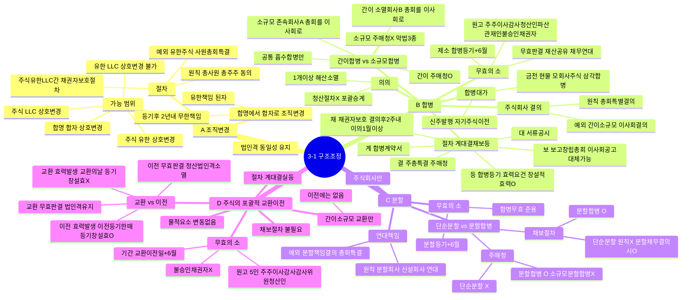

# 3-1 구조조정 마인드맵

← [[3-1_구조조정_정리노트|원본 정리노트]]

---

---

## ★ 악법3종 set (주매청 X)

> **소규모** 합병 / 분할합병 / 주식교환 → 주식매수청구권 없음

## ★ 합병 vs 교환이전 원고 비교

| | 합병무효 | 교환이전무효 |
|--|--|--|
| 원고 | 주이감청산파 + **불승인채권자** | 주이감감사위원청산 / **불승인채권자X** |

## ★ 등기 창설적효력

| | 창설적효력 |
|--|:--:|
| 합병등기 | O |
| 주식교환 | X |
| 주식이전등기 | O |
