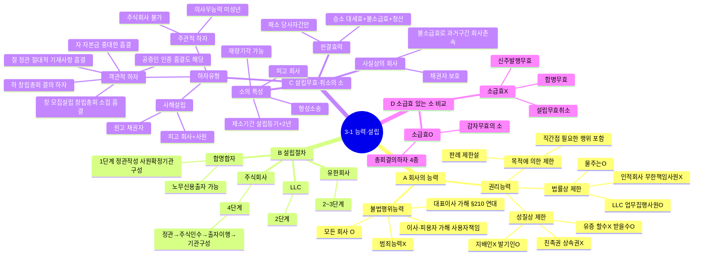

# 3-1 능력·설립 마인드맵

← [[3-1_능력_설립_정리노트|원본 정리노트]]

---

---

## ★ 암기 포인트

| 항목 | 내용 |
|------|------|
| **객관적 하자** | 절·창·하·자 + 공증인 인증 흠결 |
| **주관적 하자** | 주식회사는 불가 |
| **제소기간** | 설립등기일 + **2년** |
| **판결효력** | 대세효 + **불소급효** |
| **소급효O** | 총회결의하자 4종 + 감자무효 |
