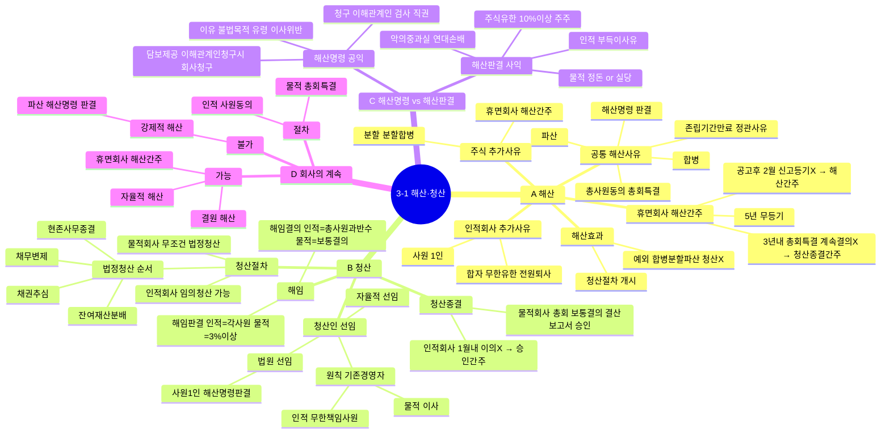

# 3-1 해산·청산 마인드맵

← [[3-1_해산_청산_정리노트|원본 정리노트]]

---

---

## ★ 암기 포인트

| 항목 | 내용 |
|------|------|
| **휴면회사** | 5년 무등기 → 2월 신고X → 해산간주 → 3년내 계속결의X → 청산종결간주 |
| **임의청산** | 인적회사만 가능 |
| **법정청산** | 물적회사 무조건 |
| **해산명령** | 공익, 직권 가능 |
| **해산판결** | 사익, 주식·유한 = 10%이상 주주 |
| **회사계속 불가** | 파산·해산명령·해산판결 |
