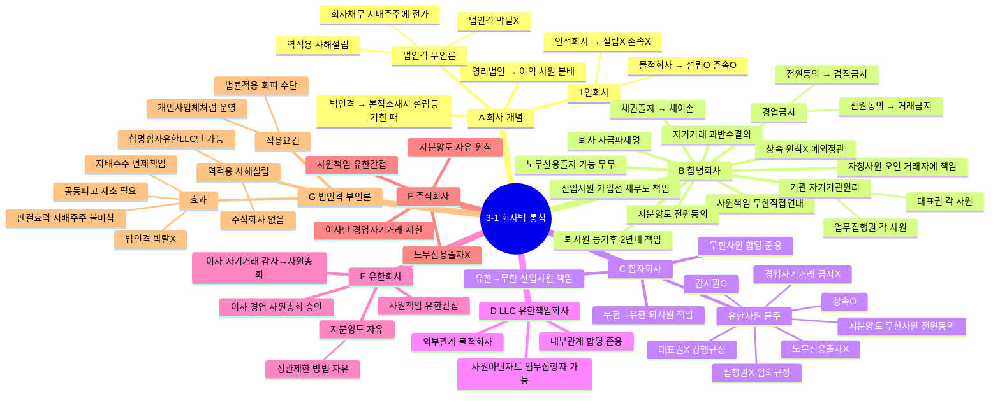

# 3-1 회사법 통칙 마인드맵

← [[3-1_회사법_통칙_정리노트|원본 정리노트]]

---

---

## ★ 5종 회사 핵심 비교

| | 합명 | 합자 | LLC | 유한 | 주식 |
|--|:--:|:--:|:--:|:--:|:--:|
| 사원책임 | 무한 | 무한+유한 | 유한 | 유한 | 유한 |
| 1인 설립 | X | X | O | O | O |
| 1인 존속 | X | X | O | O | O |
| 노무신용 | **O(무한만)** | **O(무한만)** | X | X | X |
| 지분양도 | 전원동의 | 무한전원동의 | 전원동의 | 자유 | **자유** |
| 상속 | X | 유한O무한X | 유한O무한X | O | O |

## ★ 경업·자기거래 비교

| | 경업승인 | 자기거래승인 |
|--|--|--|
| 합명 사원 | 전원동의 | 과반수 |
| 합자 무한 | 전원동의 | 과반수 |
| 합자 유한 | X | X |
| 주식 이사 | 이사회 1/2 | 이사회 2/3 |
| 유한 이사 | 사원총회 | 감사→사원총회 |
