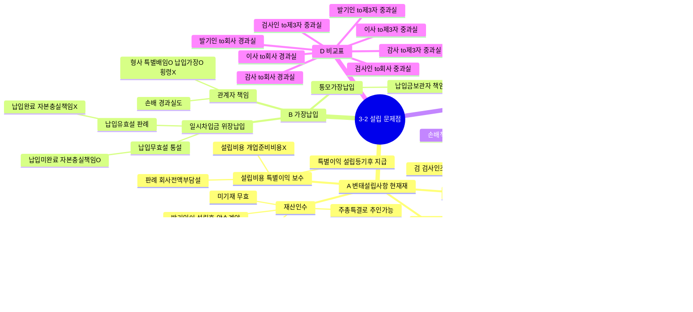

# 3-2 설립에 관련된 문제점 마인드맵

← [[3-2_설립에관련된문제점_정리노트|원본 정리노트]]

---

---

## ★ 직위별 책임 과실 기준

| 직위 | to 회사 | to 제3자 |
|------|:-------:|:--------:|
| 발기인 | 경과실도 | **중**과실 |
| 이사 | 경과실도 | **중**과실 |
| 감사 | 경과실도 | **중**과실 |
| 검사인 | **중**과실 | **중**과실 |

> TIP: 경과실 → to 제3자 책임 없음

## ★ 인수담보 vs 납입담보 주주

| | 발기인이 처리 | 주주가 되는 사람 |
|--|--|--|
| **인수담보** | 발기인이 인수인 됨 | **발기인** |
| **납입담보** | 발기인이 대납 | **원래 인수인** |
