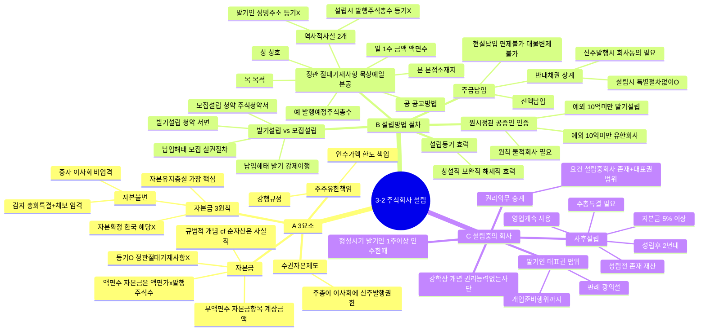

# 3-2 주식회사의 설립 마인드맵

← [[3-2_주식회사의_설립_정리노트|원본 정리노트]]

---

---

## ★ 정관 절대기재사항

> **목·상·예·일·본·공** + 역사적 사실 2개(발기인 성명·주소 / 설립시 발행주식총수)

- 자본금 → 등기O but 정관절대기재사항 **X**

## ★ 반대채권 상계 비교

| | 설립시 | 신주발행시 |
|--|:--:|:--:|
| 절차 | 불필요 | **회사동의 필요** |
