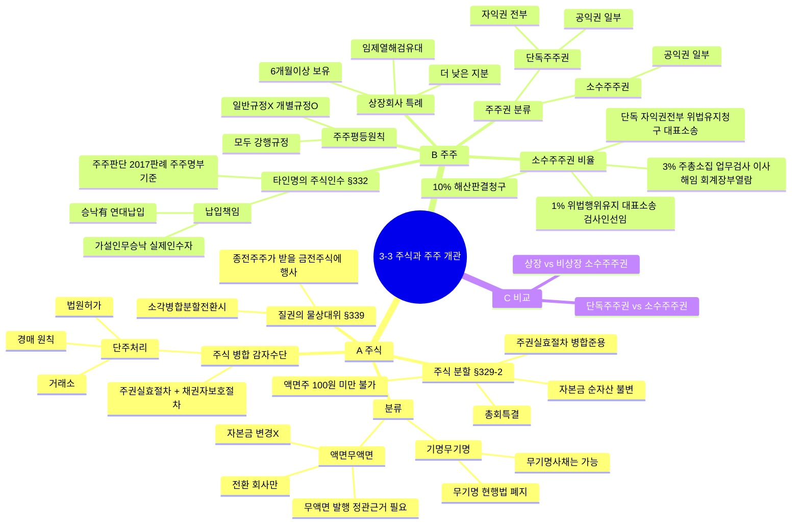

# 3-3-1 주식과 주주의 개관 마인드맵

← [[3-3_1절_주식과_주주의_개관_정리노트|원본 정리노트]]

---

---

## ★ 소수주주권 비율표

| 비율 | 권리 |
|------|------|
| **단독** | 자익권 전부, 위법행위유지청구, 대표소송 |
| **1/100** | 위법행위유지청구, 대표소송, 검사인선임청구 |
| **3/100** | 주총소집청구, 업무검사인, 이사해임청구, 회계장부열람, 설명요구 |
| **10/100** | 해산판결청구 (유일) |

> 상장회사: 보유기간 6개월 이상 + 더 낮은 지분율
