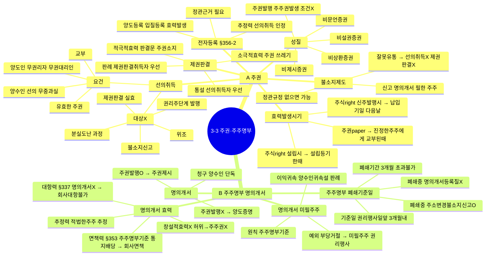

# 3-3-2 주권과 주주명부 마인드맵

← [[3-3_2절_주권과_주주명부_정리노트|원본 정리노트]]

---

---

## ★ 암기 포인트

| 항목 | 내용 |
|------|------|
| **주권 효력발생** | 진정한 주주에게 **교부**된 때 |
| **신주 효력발생** | 납입기일 **다음날** |
| **명의개서 청구** | 양수인 **단독** |
| **면책력** | 주주명부 기준 통지·배당 → 회사 면책 |
| **폐쇄기간** | **3개월** 초과 불가 |
| **부당거절** | 미필주주도 권리행사 가능 |
