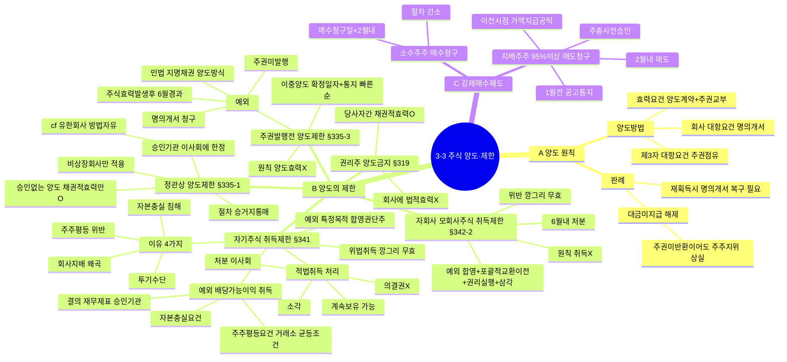

# 3-3-3 주식의 양도와 제한 마인드맵

← [[3-3_3절_주식의_양도와_제한_정리노트|원본 정리노트]]

---

---

## ★ 암기 포인트

| 항목 | 내용 |
|------|------|
| **양도 효력요건** | 양도계약 + **주권교부** |
| **회사 대항요건** | **명의개서** |
| **제3자 대항요건** | **주권점유** |
| **권리주 양도** | 당사자간 채권적효력만 |
| **주권발행전 예외** | 6월 경과 + 주권미발행 → 지명채권 방식 |
| **위법자기주식** | **깡그리 무효** (채권적효력도 X) |
| **정관 제한** | 승인기관 이사회에 한정 (비상장만) |
