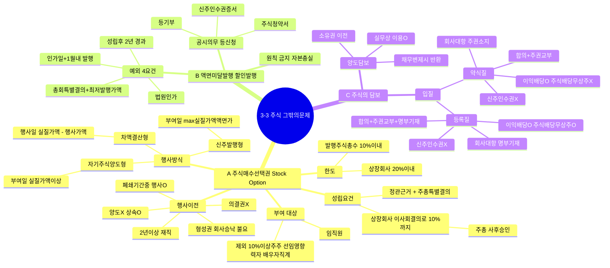

# 3-3-4 주식에 관한 그 밖의 문제 마인드맵

← [[3-3_4절_주식에_관한_그_밖의_문제_정리노트|원본 정리노트]]

---

---

## ★ 약식질 vs 등록질 비교

| | 약식질 | 등록질 |
|--|:--:|:--:|
| 효력요건 | 합의+주권교부 | +**명부기재** |
| 이익배당 | O | O |
| **주식배당·무상주** | **X** | **O** |
| 신주인수권 | X | X |

## ★ 액면미달발행 4요건

> 성립후 **2년** 경과 → **총회특결** + 최저발행가액 → **법원인가** → 인가일+**1월**내 발행
