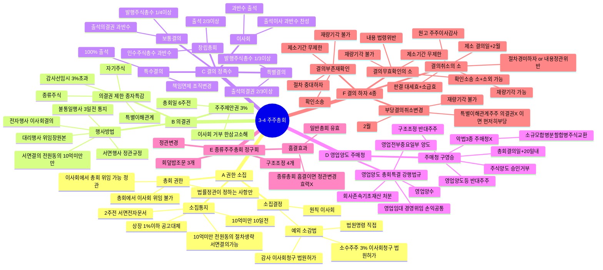

# 3-4 주주총회 마인드맵

← [[3-4_1절_주주총회_정리노트|원본 정리노트]]

---

---

## ★ 결의 하자 4종 비교

| | 취소 | 무효확인 | 부존재확인 | 부당결의 |
|--|:--:|:--:|:--:|:--:|
| 원고 | 주·이·감 | 누구나 | 누구나 | 주주 |
| 제소기간 | **2월** | 무제한 | 무제한 | **2월** |
| 재량기각 | **O** | X | X | X |
| 소급효 | O | O | O | O |
