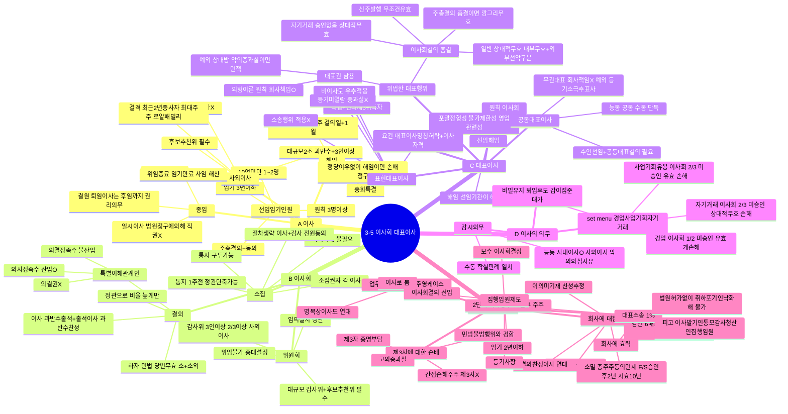

# 3-5-2 이사회와 대표이사 마인드맵

← [[3-5_2절_이사회와_대표이사_정리노트|원본 정리노트]]

---

---

## ★ set menu 비교

| | **경업** | **사업기회유용** | **자기거래** |
|--|:--:|:--:|:--:|
| 승인 | 이사회 **1/2** | 이사회 **2/3** | 이사회 **2/3** |
| 미승인 | 유효 | 유효 | **상대적무효** |
| 개입권 | **O** | X | X |

## ★ 이사회 vs 주주총회 소집 비교

| | 주주총회 | 이사회 |
|--|--|--|
| 소집권자 | 이사회 | **각 이사** |
| 통지기간 | **2주전** | **1주전** |
| 통지방법 | 서면/전자 | **구두 가능** |
| 절차생략 | — | 이사+감사 **전원동의** |
