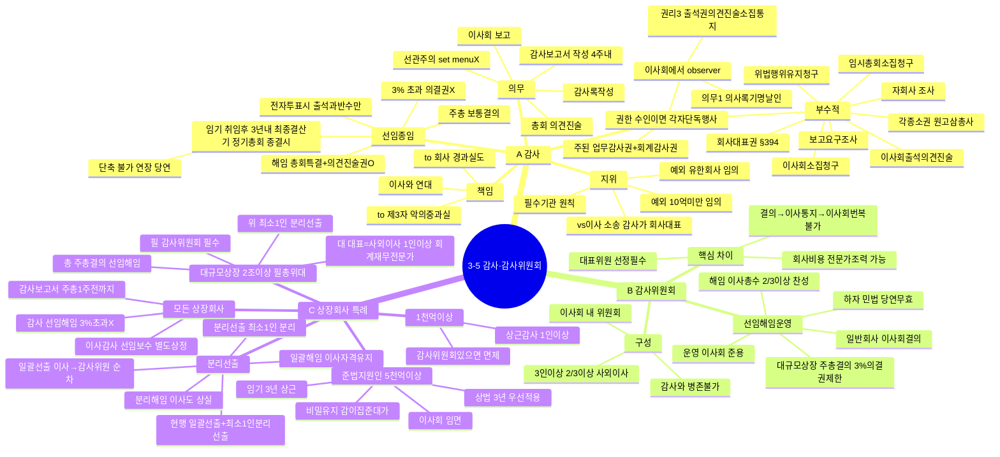

# 3-5-3 감사와 감사위원회 마인드맵

← [[3-5_3절_감사와_감사위원회_정리노트|원본 정리노트]]

---

---

## ★ 암기 포인트

| 항목 | 내용 |
|------|------|
| **감사 임기** | 취임후 3년내 최종결산기 정기총회 종결시 |
| **감사 선임** | 3% 초과 의결권 X |
| **감사위원회 구성** | 3인↑, 2/3↑ 사외이사 |
| **대규모상장** | **필·총·위·대** |
| **이사회 번복** | 감사위원회 결의 → 이사회 번복 불가 |
| **상근감사** | 1천억↑ 상장회사 |
| **준법지원인** | 5천억↑, 임기 3년 |
