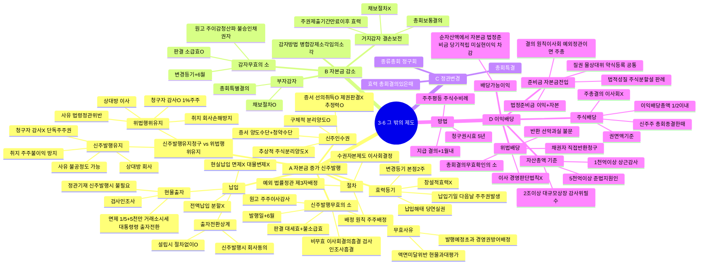

# 3-6 주식회사와 그 밖의 제도 마인드맵

← [[3-6_주식회사와_그_밖의_제도_정리노트|원본 정리노트]]

---

---

## ★ 신주발행유지 vs 위법행위유지 비교

| | 위법행위유지 | 신주발행유지 |
|--|--|--|
| 취지 | 회사 손해방지 | **주주** 불이익방지 |
| 청구자 | 감사O / 1% 주주 | 감사**X** / **단독**주주권 |
| 상대방 | 이사 | **회사** |
| 사유 | 법령·정관위반 | **불공정도 가능** |

## ★ 소급효 비교

| | 소급효 |
|--|:--:|
| 총회결의하자 4종 | **O** |
| 감자무효의 소 | **O** |
| 신주발행무효 | **X** |
| 합병무효 | **X** |
| 설립무효 | **X** |
