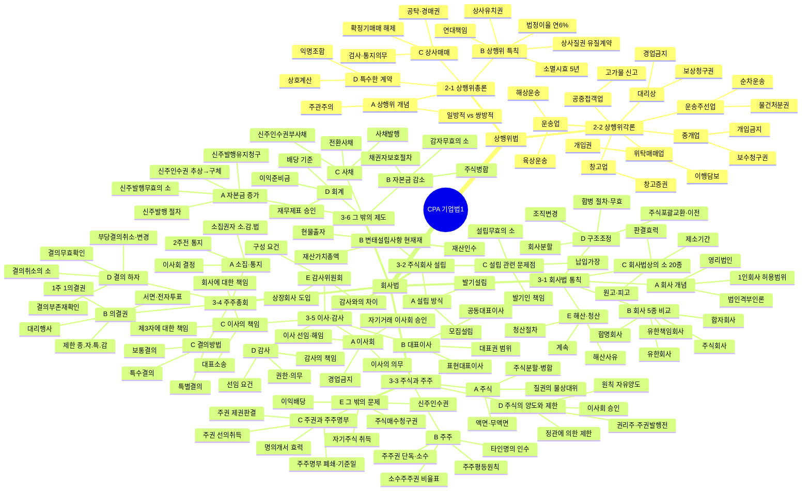

# CPA 기업법1 — 전체 구조 마인드맵

> 각 섹션 제목을 클릭하면 해당 정리노트로 이동합니다.
> Obsidian에서 Mermaid 다이어그램이 렌더링됩니다.

---

## 전체 구조도



---

## 파트별 핵심 정리 & 노트 링크

### 📌 상행위법

| 파트 | 핵심 키워드 | 노트 링크 |
|------|------------|----------|
| **2-1 상행위총론** | 주관주의 / 5년시효 / 6%이율 / 상사유치권(당피목관반) / 확정기매매 자동해제 | [[2-1_상행위총론_정리노트]] |
| **2-2 상행위각론** | 대리상 보상청구권·경업금지 / 위탁매매 개입권 / 운송인 책임 / 창고증권 | [[2-2_상행위각론_정리노트]] |

---

### 📌 회사법

| 파트 | 핵심 키워드 | 노트 링크 |
|------|------------|----------|
| **3-1 회사법 통칙** | 5종 회사 비교 / 법인격부인 / 회사의 소 20종 / 합병·분할·교환 | [[3-1_회사법_통칙_정리노트]] |
| **3-1 능력·설립** | 권리능력 범위 / 행위능력 | [[3-1_능력_설립_정리노트]] |
| **3-1 구조조정** | 합병 반대주주 매수청구 / 채권자보호 / 무효의 소 | [[3-1_구조조정_정리노트]] |
| **3-1 해산·청산** | 해산사유 / 계속 / 청산인 권한 | [[3-1_해산_청산_정리노트]] |
| **3-2 주식회사 설립** | 발기설립 vs 모집설립 / 변태설립사항(현재재) / 납입가장 | [[3-2_주식회사의_설립_정리노트]] |
| **3-2 설립 문제점** | 발기인 책임 유형 / 설립무효·취소의 소 | [[3-2_설립에관련된문제점_정리노트]] |
| **3-3 주식개관** | 주식분할·병합 / 소수주주권 비율(1/3/10%) / 주주평등원칙 | [[3-3_1절_주식과_주주의_개관_정리노트]] |
| **3-3 주권·주주명부** | 주권 선의취득 / 제권판결 / 명의개서 / 기준일 | [[3-3_2절_주권과_주주명부_정리노트]] |
| **3-3 주식 양도·제한** | 정관제한 / 이사회 승인 / 권리주 양도 제한 | [[3-3_3절_주식의_양도와_제한_정리노트]] |
| **3-3 그 밖의 문제** | 신주인수권 / 이익배당 / 자기주식 취득 | [[3-3_4절_주식에_관한_그_밖의_문제_정리노트]] |
| **3-4 주주총회** | 소집통지 2주 / 의결권 제한(종자특감) / 결의하자 4종 비교 | [[3-4_1절_주주총회_정리노트]] |
| **3-5 이사회·대표이사** | 자기거래 승인 / 경업금지 / 표현대표이사 | [[3-5_2절_이사회와_대표이사_정리노트]] |
| **3-5 감사·감사위원회** | 감사 권한 / 감사위원회 구성 / 이사 책임 추궁 | [[3-5_3절_감사와_감사위원회_정리노트]] |
| **3-6 그 밖의 제도** | 신주발행 유지·무효의 소 / 전환사채 / 이익준비금 | [[3-6_주식회사와_그_밖의_제도_정리노트]] |

---

## 자주 나오는 비교표 (★★★★★)

### 회사 5종 핵심 비교

| 구분 | 합명 | 합자 | 유한책임 | 유한 | 주식 |
|------|------|------|----------|------|------|
| 사원 책임 | 무한 | 무한+유한 | 유한 | 유한 | 유한 |
| 지분 양도 | 전원동의 | 업무집행사원 동의 | 전원동의(정관 완화) | 사원총회 승인 | **자유** |
| 1인 설립 | ✕ | ✕ | ○ | ○ | ○ |
| 1인 존속 | ✕ | ✕ | ○ | ○ | ○ |

---

### 결의 방법 비교

| 종류 | 출석 요건 | 찬성 요건 | 주요 사항 |
|------|----------|----------|----------|
| 보통결의 | 과반수 | 출석 과반수 | 이사·감사 선임, 재무제표 승인 |
| 특별결의 | 과반수 (1/3이상) | 출석 2/3이상 | 정관변경, 합병, 감자, 영업양도 |
| 특수결의 | 전원 | 전원 | 총회소집절차 생략 (10억미만 가능) |

---

### 결의 하자 4종 비교 ★★★★★

| 구분 | 근거 | 원고 | 제소기간 | 효력 |
|------|------|------|----------|------|
| 결의취소 | §376 | 주·이·감 | **2개월** | 취소 전까지 유효 |
| 결의무효확인 | §380 | 누구나 | 없음 | 처음부터 무효 |
| 결의부존재확인 | §380준용 | 누구나 | 없음 | 처음부터 부존재 |
| 부당결의취소·변경 | §381 | 주주 | **없음** | 법원 재량 |

---

### 회사법상 소(訴) — 원성당제절판

| 두문자 | 소의 종류 | 기간 | 효력 |
|--------|----------|------|------|
| **원** | 원시정관 인증 흠결 → 설립무효 | 2년 | 대세효 |
| **성** | 설립무효의 소 | 2년 | 대세효 |
| **당** | 설립취소의 소 | 2년 | 대세효 |
| **제** | 제3자 배정 신주발행 무효 | 6월 | 대세효 |
| **절** | 절차위반 신주발행 무효 | 6월 | 대세효 |
| **판** | 판결 확정 후 소 제기 불가 | — | — |

> → 전체 목록은 [[3-1_회사법_통칙_정리노트]] 참조

---

### 소수주주권 지분 비율 비교

| 비율 | 권리 (비상장) | 비고 |
|------|-------------|------|
| **단독** | 자익권 전부 / 위법유지청구 / 대표소송 | — |
| **1/100** | 위법행위유지청구, 대표소송, 검사인선임 | 상장: 더 낮음 |
| **3/100** | 주총소집청구, 업무검사인, 이사해임청구, 설명요구, 회계장부열람 | 대부분 여기 |
| **10/100** | 해산판결청구 | only 이것만 |

---

## 학습 순서 추천

```
1단계 (기초) → 2-1 상행위총론 → 2-2 상행위각론
2단계 (회사 종류) → 3-1 회사법 통칙 (회사 5종 비교 완전 암기)
3단계 (주식회사 설립) → 3-2 설립 → 3-2 설립 문제점
4단계 (주식) → 3-3 (1절→2절→3절→4절 순서대로)
5단계 (기관) → 3-4 주주총회 → 3-5 이사회·대표이사 → 3-5 감사
6단계 (자본) → 3-6 신주발행·감자·사채·회계
7단계 (구조조정) → 3-1 구조조정 → 3-1 해산·청산
```

> 기출 빈출도: **3-4 결의하자** > **3-5 이사책임** > **3-3 주식양도** > **3-1 회사의 소** > **2-1 상사유치권**
